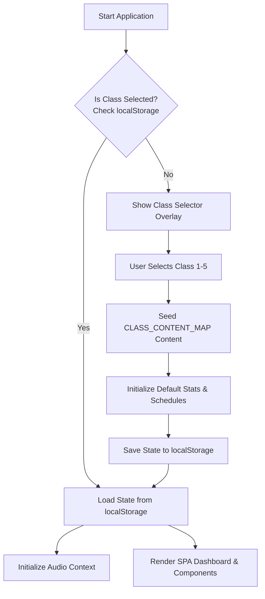
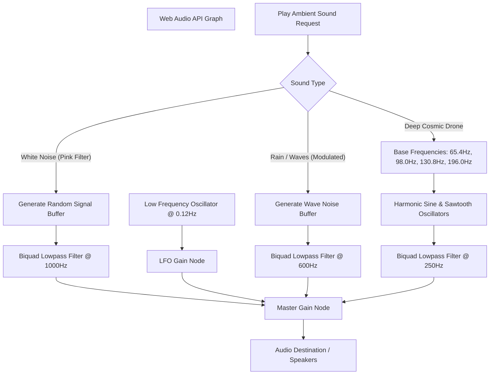
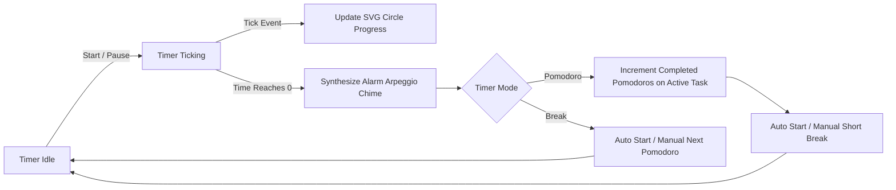

# StudyMentor: Premium Glassmorphic Study Planner & Focus Hub 🌌

Welcome to **StudyMentor** (formerly Aura Study Hub) – a premium, visually stunning, and highly interactive Single-Page Application (SPA) designed to elevate student productivity. Built using modern glassmorphic aesthetics, fluid micro-interactions, and robust offline-first sound synthesis capabilities, StudyMentor offers a personalized focus ecosystem.

---
##this is good
## 🗺️ Architectural Workflow & Data Flows

### 1. Scholar Onboarding & State Initialization Flow
When a user visits StudyMentor for the first time, they select their educational grade (Class 1 to 5). This selection acts as a seed to generate age-appropriate tasks, flashcard decks, quizzes, and schedules.



### 2. Audio Synthesizer Engine (Web Audio API)
Unlike traditional web players, StudyMentor does not fetch external MP3 files. It synthesizes soundwaves dynamically in the browser utilizing the Web Audio API, which functions completely offline.



### 3. Pomodoro Focus Session Lifecycle
The core productivity tool features an interactive, tick-synchronized Pomodoro timer linked to user tasks.



---

## ✨ Features

- **🎓 Personalized Class Selector**: Tailors tasks, flashcards, study schedules, and interactive quizzes specifically for **Class 1 to Class 5** learners upon setup.
- **📅 Weekly Planner Grid**: A sleek time-blocking calendar layout from 8:00 AM to 10:00 PM for managing and tracking scheduled classes and sessions.
- **📝 Task Manager (To-Do List)**: Full CRUD support for tasks, featuring high/medium/low priority tags, subject filters, and custom Pomodoro targets.
- **⏱️ Pomodoro Timer**: A responsive, SVG circular countdown timer that synchronizes with the active task and plays a custom arpeggio alert sound upon completion.
- **🔊 Offline Audio Machine**: High-quality, dynamically synthesized ambient noises (White Noise, Ocean Swell, Cosmic Drone) running entirely offline using oscillators, LFOs, and filters.
- **🗂️ CSS 3D Flashcards**: Fully responsive virtual flashcard decks with smooth CSS 3D flip card animations and self-assessment buttons.
- **🧠 Interactive Quiz Hub**: Customizable quizzes with real-time grade-specific questions and instantaneous feedback.
- **⚡ Pop Quiz Refresher**: A persistent floating memory refresher that prompts the user with quick review questions.

---

## 🛠️ Technology Stack

- **Markup**: Semantic HTML5 layout structure.
- **Styling**: Vanilla CSS3 featuring glassmorphic backgrounds (`backdrop-filter`), CSS custom variables, keyframe animations, and 3D card perspectives.
- **Logic**: Vanilla ES6 JavaScript handling states, localStorage synchronization, routing, and synthesizer controls.
- **Web Audio API**: Real-time sound wave generation and filtering nodes.

---

## 🚀 How to Run Locally

Because StudyMentor is built with standard, vanilla front-end files, there are no heavy bundlers or complex installation commands needed.

### Option 1: Using a Simple HTTP Server (Recommended)
Running the app through an HTTP server ensures full Web Audio API initialization and browser local storage security settings function seamlessly without CORS alerts:

```bash
# Using Python (standard on Windows/macOS/Linux)
python -m http.server 8080
```
Then, open [http://localhost:8080](http://localhost:8080) in your web browser.

### Option 2: Run directly
You can open the [index.html](index.html) file directly in any modern web browser.

---

## 📁 File Structure

```
├── index.html       # Application layouts, modal structures, and SPA router panels
├── style.css        # Responsive layouts, glassmorphism theme, and CSS 3D transforms
├── app.js           # Core state controller, default databases, and synthesizers
├── .gitignore       # Git exclusion configuration
└── README.md        # Comprehensive architecture and user guide
```
